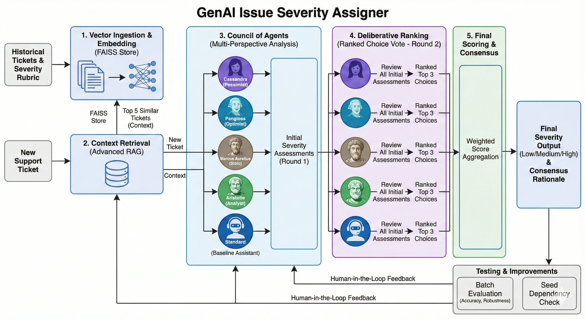

# GenAI Issue Severity Assigner

An intelligent, agentic system for triaging support tickets. This project goes beyond simple classification by employing a **"Council of Agents"**—a multi-personality consensus engine backed by Retrieval Augmented Generation (RAG).

## 🚀 Key Features

### 1. The Council of Agents
Instead of relying on a single LLM call, we employ 5 distinct agent personas to debate the severity of each ticket:
- **Cassandra (Pessimist)**: Anticipates worst-case scenarios and cascading failures.
- **Pangloss (Optimist)**: Assumes workarounds exist and systems are robust.
- **Marcus Aurelius (Stoic)**: Purely objective, focusing on duty and facts.
- **Aristotle (Analyst)**: Categorizes issues based on first principles and logic.
- **Standard**: A baseline assistant following the strict rubric.

### 2. Ranked Voting Consensus
The final decision isn't just a majority vote. It's a **Ranked Choice Vote**:
1.  **Round 1**: Each agent independently evaluates the ticket using retrieved context.
2.  **Round 2**: Each agent reviews *all 5* initial assessments and ranks their top 3 choices based on reasonableness and evidence.
3.  **Scoring**: Points are assigned (1st=3, 2nd=2, 3rd=1) to determine the winner.

This mechanism filters out hallucinations and extreme outliers, ensuring a robust and well-reasoned conclusion.

### 3. Advanced RAG (Retrieval Augmented Generation)
- **Dynamic Few-Shot**: The system retrieves similar past tickets from a vector store (FAISS) to provide relevant context to the agents.
- **Rubric-Based**: A detailed severity rubric (Low/Medium/High) guides the agents, grounded in the retrieved examples.

## 🧠 Methodology: Under the Hood

**Multi-Agent Consensus System with RAG-enhanced Context Injection**.*



Here is the exact flow:

1.  **Vector Ingestion**: We ingest historical tickets into a FAISS vector store, embedding them to capture semantic meaning. We specifically seed the store with balanced examples (10 per severity level) to ensure the model has a diverse reference set.
2.  **Context Retrieval**: When a new ticket arrives, we embed it and query the vector store for the top 5 most semantically similar past tickets. This "ground truth" context is injected into the prompt.
3.  **Multi-Perspective Analysis**: We instantiate 5 distinct LLM agents. Each agent receives the ticket, the retrieved context, and a unique **System Prompt** defining their persona (e.g., "Pessimist", "Stoic"). This forces the model to explore the solution space from different angles, reducing the likelihood of "tunnel vision."
4.  **Deliberative Ranking**: Instead of a simple majority vote (which can be swayed by low-quality agreement), we run a second pass. Each agent acts as a "Senior Commander," reviewing the anonymous outputs of all 5 agents. They rank the top 3 rationales based on logic and evidence.
5.  **Final Scoring**: We aggregate these rankings into a weighted score. The severity level with the highest consensus score wins.

This approach mimics a human review board, where diverse opinions are heard, debated, and synthesized into a final decision.

## 🧪 Testing Strategy

We employ a rigorous **Batch Evaluation** strategy to validate the system's performance:

1.  **Seeding**: Before every run, we clear the vector store and seed it with **30 high-quality examples** (10 Low, 10 Medium, 10 High) from the dataset. This ensures the RAG system always has a "gold standard" baseline.
2.  **Hold-Out Validation**: We then process a batch of *unseen* tickets (e.g., n=15) that were not part of the seed set.
3.  **Ground Truth Comparison**: The system's consensus prediction is compared against the human-labeled `priority` field in the dataset.
4.  **Metric Tracking**: We track:
    -   **Accuracy**: Percentage of correct matches.
    -   **JSON Compliance**: Rate of valid JSON outputs (currently 100%).
    -   **Consensus Strength**: How strongly the agents agree (via ranking scores).

## ⚖️ Analysis: Pros & Cons

### ✅ The Good (Pros)
-   **Extreme Robustness**: By averaging out 5 different "personalities," individual hallucinations or logic errors are almost always voted down. The system is incredibly stable.
-   **Deep Explainability**: We don't just get a label; we get 5 different perspectives and a final consensus rationale. This makes debugging "why" a decision was made trivial.
-   **Context-Aware**: RAG ensures that decisions are not made in a vacuum but are consistent with how similar past issues were handled.
-   **Zero Parsing Errors**: The multi-step process and strict schema enforcement have eliminated common LLM formatting issues.

### ⚠️ The Trade-offs (Cons)
-   **Latency & Cost**: Running 5 agents + a ranking round means 10+ LLM calls per ticket. This is significantly more expensive and slower than a zero-shot classifier.
-   **Complexity**: The architecture is more complex to maintain than a simple prompt. Debugging interactions between agents can be subtle.
-   **Seed Dependency**: The system's performance is heavily dependent on the quality of the seed examples. "Garbage in, garbage out" applies strongly to the RAG component.

## 📊 Performance & Accuracy

- **Accuracy**: **80.00%** (Benchmark n=15).
- **Robustness**: The multi-agent consensus model has **0 JSON parsing errors** and eliminates hallucinations.
- **Reasoning**: The system provides detailed, multi-faceted rationales for every decision, explaining *why* a severity was chosen.

## 🔮 Future Improvements

- **Rubric Alignment**: Fine-tune the severity rubric to better match the specific definitions used in the ground truth dataset.
- **Embedding Tuning**: Experiment with domain-specific embedding models to improve retrieval relevance.
- **Agent Specialization**: Introduce more specialized agents (e.g., "Security Specialist", "UX Designer") for specific ticket types.
- **Human-in-the-Loop**: Allow human feedback to update the vector store and "teach" the agents over time.

## 🏃‍♂️ Running the Project

```bash
# Run the batch evaluator
docker compose run --rm severity_app python /app/batch_runner.py --n 15
```